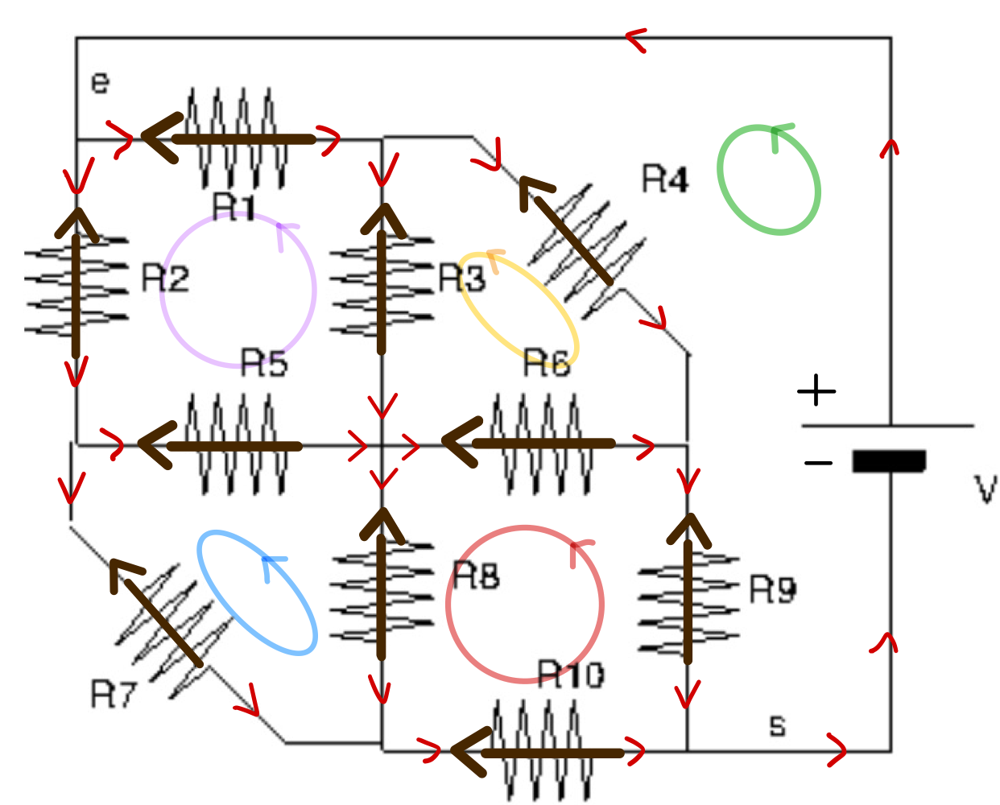

# Circuit électrique à 10 résistances

Calcul du courant dans chaque branche d'un circuit résistif, du courant fourni par le générateur et de la résistance équivalente. Les lois de Kirchhoff donnent un système linéaire de 10 équations, résolu par **élimination de Gauss avec pivot partiel** codée entièrement à la main, sans aucune bibliothèque externe.



*Schéma du circuit. Les flèches indiquent le sens choisi a priori pour chaque courant, les boucles colorées les cinq mailles utilisées.*

> **En bref**
> - 5 lois des nœuds et 5 lois des mailles donnent un système $R \cdot I = U$ de taille 10.
> - Résolution par élimination de Gauss avec pivot partiel, puis rétro-substitution, en Python pur.
> - Courant du générateur : 6,378 mA ; résistance équivalente : 7 839 Ω.
> - Trois vérifications : résidu de $10^{-18}$, bilan de puissance exact, loi des nœuds au point de sortie.

## 1. Objectif

Pour un circuit donné (générateur de 50 V et 10 résistances), déterminer :

- l'intensité et le sens du courant dans chaque résistance ;
- le courant fourni par le générateur ;
- la résistance équivalente entre l'entrée $e$ et la sortie $s$.

## 2. Données

| $R_1$ | $R_2$ | $R_3$ | $R_4$ | $R_5$ | $R_6$ | $R_7$ | $R_8$ | $R_9$ | $R_{10}$ |
|---|---|---|---|---|---|---|---|---|---|
| 2 400 Ω | 8 000 Ω | 5 300 Ω | 7 900 Ω | 1 900 Ω | 8 900 Ω | 1 400 Ω | 6 000 Ω | 9 700 Ω | 6 800 Ω |

Tension du générateur : $V = 50$ V.

## 3. Mise en équations : lois de Kirchhoff

On choisit arbitrairement un sens pour chaque courant $I_1, \dots, I_{10}$ (flèches du schéma). Si un courant calculé est négatif, il circule en réalité dans l'autre sens.

### Loi des nœuds

En chaque nœud, la somme des courants entrants est égale à la somme des courants sortants (conservation de la charge). Pour les cinq nœuds internes du circuit :

$$\begin{aligned}
I_3 + I_4 - I_1 &= 0 \cr 
I_5 + I_7 - I_2 &= 0 \cr 
I_3 + I_5 - I_6 - I_8 &= 0 \cr 
I_4 + I_6 - I_9 &= 0 \cr 
I_7 + I_8 - I_{10} &= 0
\end{aligned}$$

### Loi des mailles

Le long d'une boucle fermée, la somme des tensions est nulle (conservation de l'énergie). Avec la loi d'Ohm $U = RI$, et pour les cinq mailles du schéma :

$$\begin{aligned}
R_1 I_1 - R_2 I_2 + R_3 I_3 - R_5 I_5 &= 0 && \text{(maille rose)} \cr 
-R_3 I_3 + R_4 I_4 - R_6 I_6 &= 0 && \text{(maille jaune)} \cr 
R_5 I_5 - R_7 I_7 + R_8 I_8 &= 0 && \text{(maille bleue)} \cr 
R_6 I_6 - R_8 I_8 + R_9 I_9 - R_{10} I_{10} &= 0 && \text{(maille rouge)} \cr 
R_1 I_1 + R_4 I_4 + R_9 I_9 &= V && \text{(maille verte, par le générateur)}
\end{aligned}$$

### Forme matricielle

Ces 10 équations forment un système linéaire $R \cdot I = U$ : chaque ligne de la matrice $R$ contient les coefficients d'une équation (des $\pm 1$ pour les nœuds, des résistances pour les mailles), et $U = (0, \dots, 0, V)$. Le courant du générateur n'est pas une inconnue supplémentaire : au nœud d'entrée, il vaut $I_1 + I_2$.

## 4. Résolution numérique

### Élimination de Gauss

On transforme le système en un système triangulaire supérieur équivalent. Pour chaque colonne $k$ :

1. **Choix du pivot** : on cherche, parmi les lignes $k$ à $n-1$, celle dont le coefficient en colonne $k$ est le plus grand en valeur absolue, et on l'échange avec la ligne $k$ (**pivot partiel**).
2. **Test de singularité** : si ce pivot est inférieur à $10^{-6}$, la matrice est considérée comme singulière et le programme s'arrête.
3. **Élimination** : pour chaque ligne $i > k$, on retranche $h = R_{ik}/R_{kk}$ fois la ligne $k$, ce qui annule le coefficient $R_{ik}$. La même opération est appliquée au second membre $U$.

Le pivot partiel est indispensable ici. La matrice contient des zéros sur sa diagonale initiale, et mélange des coefficients de l'ordre de 1 (lois des nœuds) et de l'ordre de $10^3$ (lois des mailles). Diviser par un petit pivot amplifierait les erreurs d'arrondi.

### Rétro-substitution

Le système étant triangulaire, on le résout en partant de la dernière ligne, qui ne contient qu'une inconnue, puis en remontant :

$$I_{n-1} = \frac{U_{n-1}}{R_{n-1,n-1}}, \qquad I_i = \frac{1}{R_{ii}}\left(U_i - \sum_{j > i} R_{ij}\thinspace I_j\right)$$

Le coût total est de l'ordre de $\frac{2}{3}n^3$ opérations, négligeable pour $n = 10$.

### Choix d'implémentation

Le programme n'utilise aucune bibliothèque externe, pas même NumPy : il se lance sur n'importe quelle installation de Python. Ce choix vient de difficultés d'import de bibliothèques rencontrées lors du projet, et oblige à écrire soi-même tout l'algorithme.

## 5. Résultats

| Courant | Valeur (mA) | Courant | Valeur (mA) |
|---|---|---|---|
| $I_1$ | 3,862 | $I_6$ | 0,623 |
| $I_2$ | 2,516 | $I_7$ | 2,956 |
| $I_3$ | 1,891 | $I_8$ | 0,829 |
| $I_4$ | 1,971 | $I_9$ | 2,594 |
| $I_5$ | −0,440 | $I_{10}$ | 3,784 |

- $I_5$ est négatif : dans la résistance $R_5$, le courant circule dans le sens **opposé** à celui choisi sur le schéma.
- Courant fourni par le générateur : $I = I_1 + I_2 = 6{,}378$ mA.
- Résistance équivalente vue par le générateur : $R_{eq} = V / I \approx 7\thinspace 839\ \Omega$.

## 6. Vérifications

Trois tests confirment la solution :

| Test | Résultat |
|---|---|
| **Résidu** : $\max \lvert R \cdot I - U \rvert$ sur le système d'origine | $1{,}7 \times 10^{-18}$ (précision machine) |
| **Bilan de puissance** : puissance fournie $V \cdot I$ et puissance dissipée par effet Joule $\sum_k R_k I_k^2$ | 318,914 mW dans les deux cas |
| **Loi des nœuds au point de sortie $s$** : le courant qui revient au générateur, $I_9 + I_{10}$, doit égaler celui qui en part, $I_1 + I_2$ | 6,378 mA dans les deux cas |

Le résidu vérifie la résolution numérique : il est affiché par le script, comme le bilan de puissance. Les deux autres tests vérifient la **mise en équations** elle-même. La loi des nœuds en $s$ ne fait pas partie du système, mais elle découle des cinq lois des nœuds internes si elles sont écrites avec des signes cohérents : elle contrôle donc ces cinq équations. Le bilan de puissance contrôle l'ensemble, lois des mailles comprises : une erreur de signe dans une maille donnerait une solution du système (résidu nul) mais un bilan de puissance faux.

## 7. Limites et pistes

- Pour des systèmes plus grands, `numpy.linalg.solve` fait le même calcul (factorisation LU avec pivot partiel, bibliothèque LAPACK) en code compilé, beaucoup plus rapidement.
- Écrire les équations à la main devient vite source d'erreurs de signe. Les simulateurs de circuits comme SPICE construisent automatiquement le système à partir de la liste des composants, par l'**analyse nodale modifiée** : les inconnues sont les potentiels des nœuds (et les courants dans les sources de tension), et la matrice est creuse et bien structurée.
- Le même programme peut traiter n'importe quel circuit résistif en changeant la matrice : on pourrait le généraliser pour lire les composants dans un fichier.

## 8. Lancer le code

```bash
python circuit.py
```

Aucune bibliothèque externe n'est nécessaire.

---

Projet réalisé en L3 Physique à CY Cergy Paris Université (cours de méthodes numériques, septembre 2024).
